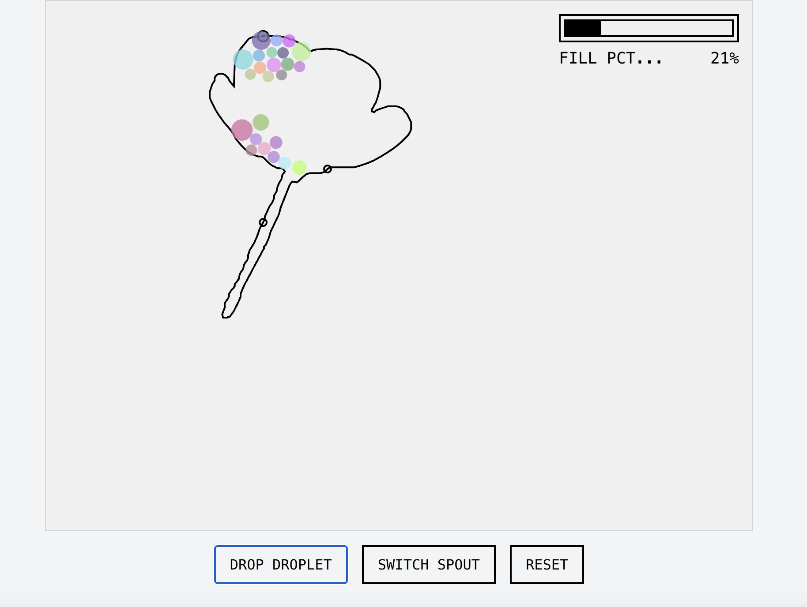

# Flower Filler Game

A browser-based flower filling game where you drop colored droplets to fill in flower outlines. Fill the flower to 90% to reveal the original image!

## Play the Game

🌸 [Play Flower Filler](https://semajyllek.github.io/flower-filler)

## How to Play

1. Click "DROP DROPLET" to release a colored droplet
2. Click "SWITCH SPOUT" to change the drop location
3. Fill the flower outline to 90% to win and reveal the original flower image
4. Click "RESET" to get a new flower

Now with Dark Mode!

## Development

Built with:
- React
- TypeScript
- p5.js for physics and rendering
- Tailwind CSS for styling